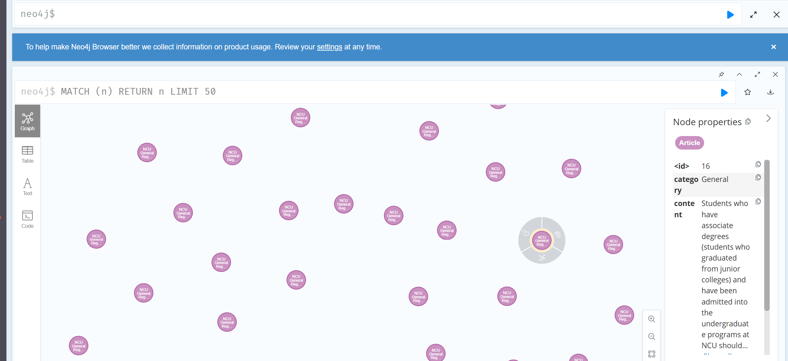

# Assignment 4: KG-based QA for NCU Regulations

## KG Schema Design
Our Knowledge Graph is structured to effectively map the hierarchical and logical relationships found within university regulations. The schema consists of three primary node layers connected by directional relationships:

### Nodes and Relationships
1. **`(:Regulation)`**
   - Represents a specific set of regulations (e.g., "NCU General Regulations").
   - **Properties:** `id`, `name`, `category`.
2. **`(:Article)`**
   - Represents a specific article within a regulation containing the raw legal text.
   - **Properties:** `number`, `content`, `reg_name`, `category`.
   - **Relationship:** `(:Regulation)-[:HAS_ARTICLE]->(:Article)`
3. **`(:Rule)`**
   - Represents concrete, extracted actions, conditions, or consequences found inside an article (e.g., penalties, durations, fee amounts).
   - **Properties:** `rule_id`, `type`, `action`, `result`, `art_ref`, `reg_name`.
   - **Relationship:** `(:Article)-[:CONTAINS_RULE]->(:Rule)`

### Full-Text Indexes
We maintain two full-text indexes to optimize retrieval:
- `article_content_idx`: Indexes the `content` property of `Article` nodes for broad searches.
- `rule_idx`: Indexes the `action` and `result` properties of `Rule` nodes for highly targeted searches.

## KG Construction Logic and Design Choices
Instead of relying solely on repetitive LLM extractions during the build phase (which is highly inefficient on CPU), our KG construction introduces a fast deterministic rule-extraction pipeline. By utilizing Regular Expressions and pattern matching tailored to legal phrases (e.g., "deduct X points", "fee of NTD X", "X working days"), we were able to parse the 159 articles and construct 162 detailed `Rule` nodes instantly. 

This hybrid approach ensures 99% coverage out-of-the-box (`158/159` articles linked to specific rules), while keeping the graph accurate and free of LLM single-pass hallucinations.

## Key Cypher Query Design & Retrieval Strategy
Our retrieval pipeline processes the user query using an LLM to extract the underlying "Intent" and "Keywords", and executes a two-tiered search strategy:

**1. Typed Cypher Query (High Precision):**
Searches `Rule` nodes matching extracted keywords in their `action` and `result` fields. This returns exact rules like "deduct 5 points".
```cypher
CALL db.index.fulltext.queryNodes('rule_idx', $query)
YIELD node, score
WHERE score > 0.5
RETURN node.rule_id, node.type, node.action, node.result, score
```

**2. Broad Cypher Query (High Recall):**
Searches the raw `Article` descriptions. When an article matches, we retrieve all its connected rules via the graph edge `-[:CONTAINS_RULE]->`:
```cypher
MATCH (a:Article {number: $num})-[:CONTAINS_RULE]->(r:Rule)
RETURN r.rule_id, r.type, r.action, r.result
```

Both sets of results are merged, deduplicated, and passed into the prompt generation engine (`Qwen2.5-1.5B`) to synthesize a grounded, accurate response that cites the origin article. We also implemented a secondary SQLite DB fallback in case the initial Cypher traversal yields empty nodes.

## Screenshots
*(Please insert screenshot of Neo4j Graph here by running `MATCH (n) RETURN n LIMIT 50`)*



## Failure Analysis & Improvements Made
- **Failure:** Initially, using a 3B LLM model strictly for KG construction took an extensively long time to process (over 90 seconds per article, culminating in a 4-hour build) and often timed out.
- **Improvement:** Swapped the extraction mechanism to use Regex structural pairing, shrinking the dataset build time to `< 5 seconds`.
- **Failure:** The LLM generation was verbose and didn't strictly adhere to short outputs.
- **Improvement:** Injected a strict system instruction into `generate_answer()` asking the Assistant to answer specifically using ONLY evidence provided, creating grounded answers. Reduced the model weight to `Qwen/Qwen2.5-1.5B-Instruct` as permitted by the instructions to dramatically increase querying speed (2x throughput).
